# 🎣 FBTI - 钓鱼人大性格测试

> 你是什么类型的钓鱼人？12道题，测出你的「钓人格」

你是否曾好奇过——同样是钓鱼，为什么有人凌晨4点就起床占位，有人却能睡到自然醒再出门？有人非要钓到大鱼才肯收杆，有人却觉得能在水边坐一天就是最大的幸福？

**FBTI (Fisherman Big Personality Test)** 是一款专门为钓鱼人设计的性格测试工具，基于心理学大五人格模型的启发，结合钓鱼场景的独特行为模式，让你通过12道题深入了解自己在钓鱼时的真实性格。

---

## 🎯 在线体验
这两个地址都一样，执行根据网络情况选择
- **国内访问**：https://aiecho.cc/
- **备用访问**：https://fbti-frontend.vercel.app/

---

## 🧬 16种钓人格

FBTI 基于四个维度生成 **16种独特的人格类型**：

| 维度 | 名称 | 两极 |
|------|------|------|
| **I** | 投入强度 | H（狂热型）vs C（松弛型） |
| **S** | 相处方式 | S（群体型）vs O（独处型） |
| **T** | 偏好路径 | T（技术流）vs G（装备流） |
| **R** | 价值取向 | R（结果派）vs E（体验派） |

### 人格分布（预估）

<table>
<tr><th style="width:90px">头像</th><th style="width:120px">人格类型</th><th style="width:60px">代码</th><th style="width:60px">占比</th></tr>
<tr><td>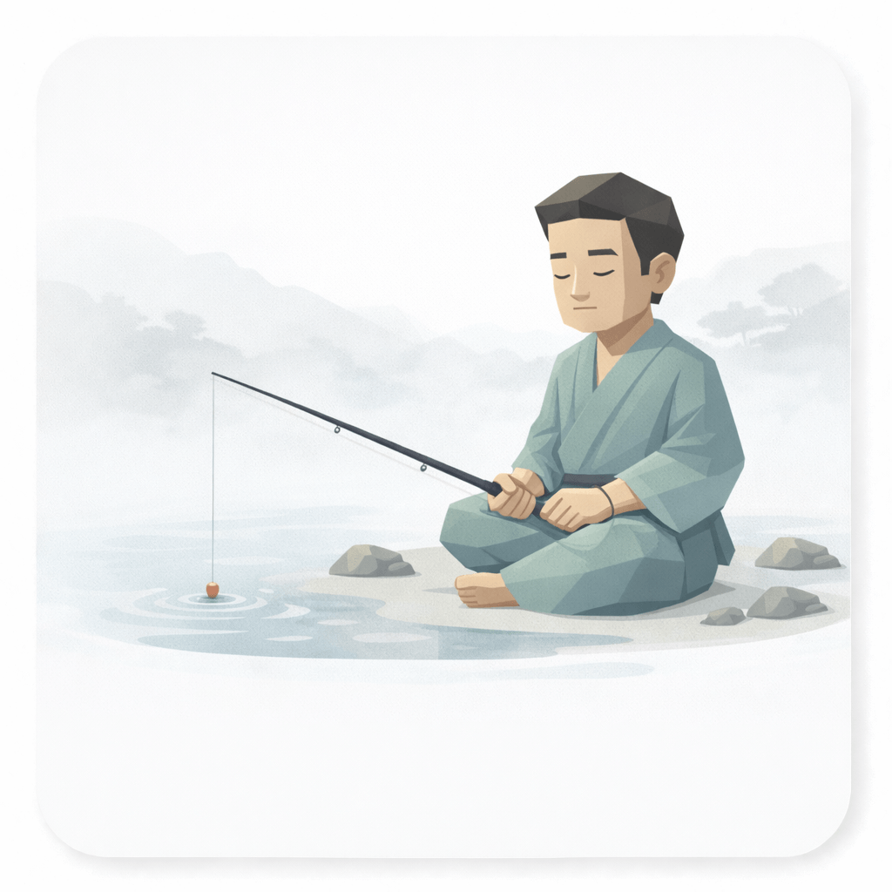</td><td>佛系钓客</td><td>COTE</td><td>15.00%</td></tr>
<tr><td>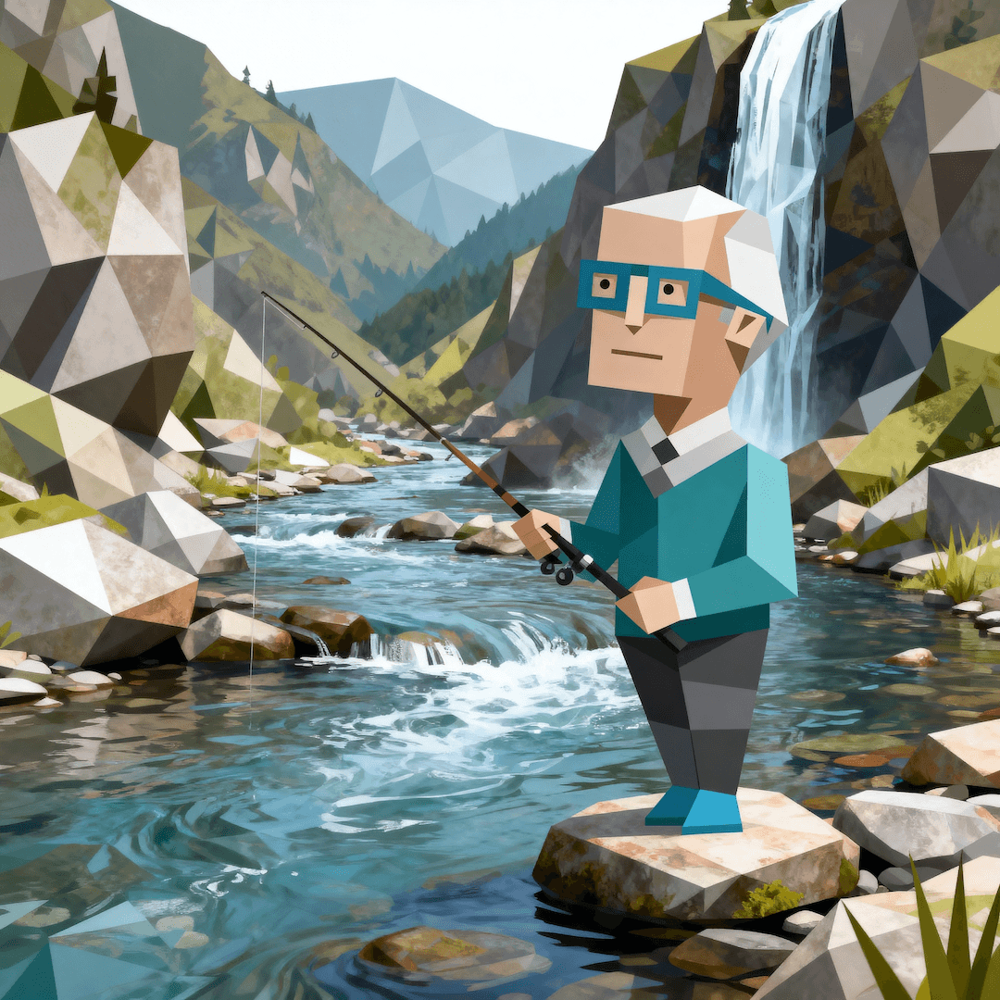</td><td>摸鱼老炮</td><td>CSTE</td><td>12.00%</td></tr>
<tr><td></td><td>岸边搭子</td><td>CSGE</td><td>10.00%</td></tr>
<tr><td>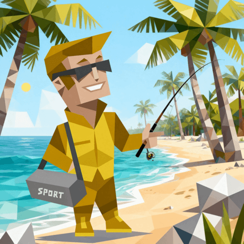</td><td>精致钓人</td><td>COGE</td><td>9.00%</td></tr>
<tr><td>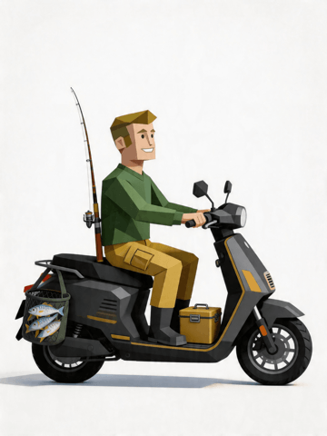</td><td>爆护独行侠</td><td>COGR</td><td>8.50%</td></tr>
<tr><td>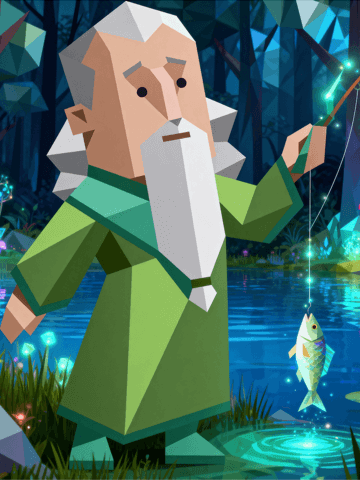</td><td>连竿手</td><td>COTR</td><td>8.00%</td></tr>
<tr><td></td><td>水边讲师</td><td>HSTE</td><td>6.50%</td></tr>
<tr><td>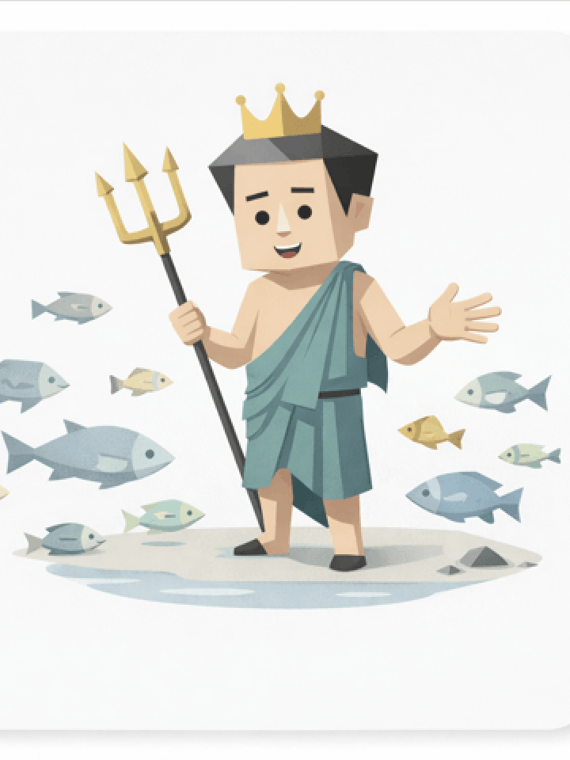</td><td>海王</td><td>HSGE</td><td>6.00%</td></tr>
<tr><td>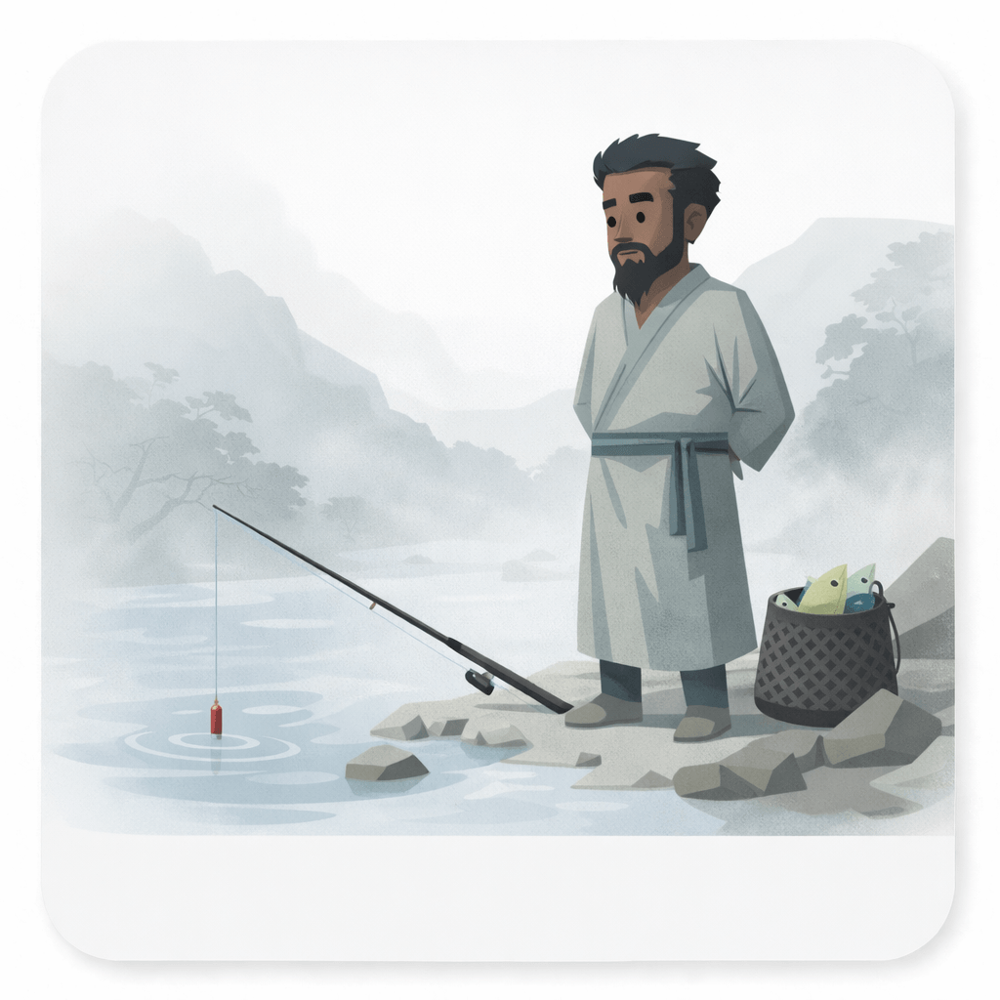</td><td>守钓宗师</td><td>HOTE</td><td>5.50%</td></tr>
<tr><td>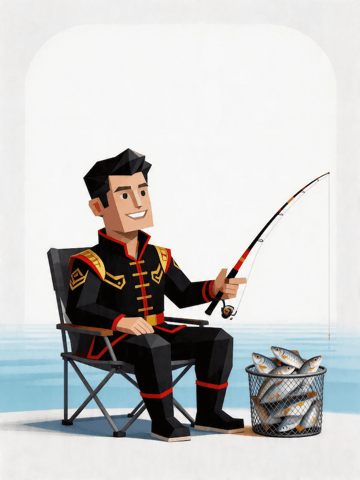</td><td>坑冠</td><td>HSTR</td><td>4.00%</td></tr>
<tr><td>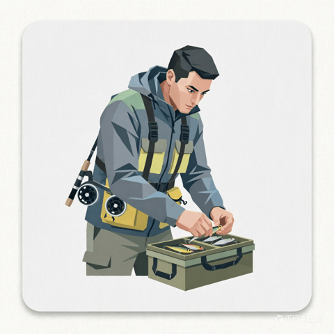</td><td>装备显眼包</td><td>CSGR</td><td>4.00%</td></tr>
<tr><td>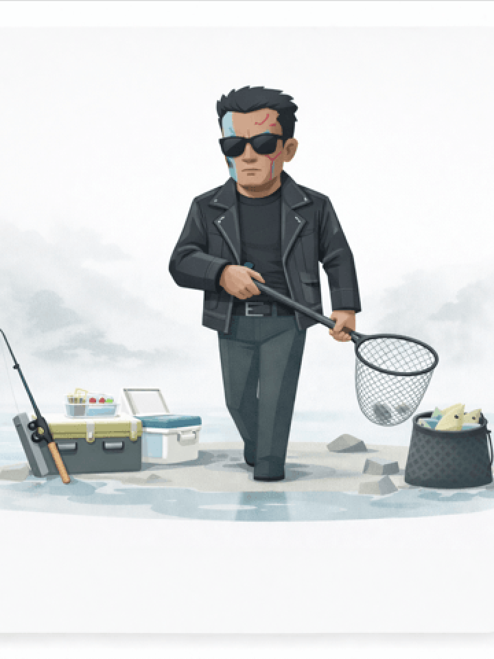</td><td>钓位终结者</td><td>HOGR</td><td>3.50%</td></tr>
<tr><td>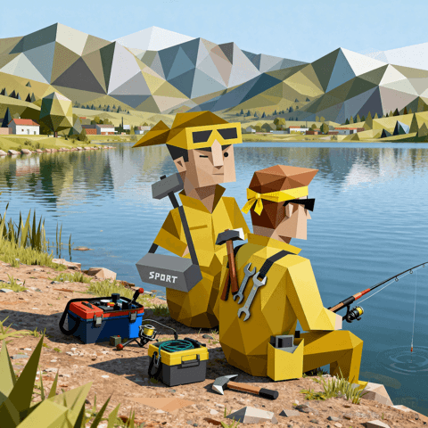</td><td>满配钓王</td><td>HSGR</td><td>3.00%</td></tr>
<tr><td>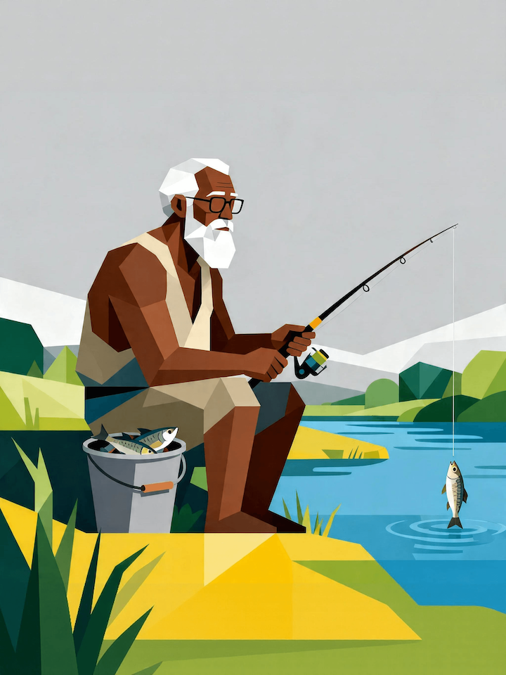</td><td>钓帝</td><td>HOTR</td><td>2.00%</td></tr>
<tr><td>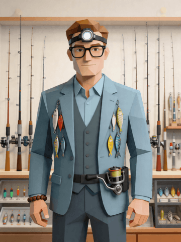</td><td>孤钓收藏家</td><td>HOGE</td><td>1.50%</td></tr>
<tr><td>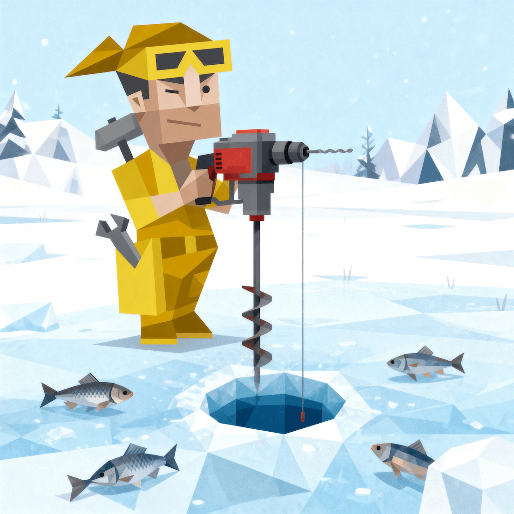</td><td>钓场军师</td><td>CSTR</td><td>1.50%</td></tr>
</table>

---

## ✨ 功能特性

- **12道精选题目** - 每道题都源自真实钓鱼场景
- **4大核心维度** - 投入强度、相处方式、偏好路径、价值取向
- **16种独特人格** - 精准描述你的钓鱼风格
- **AI生成分享图** - 自动生成精美的结果分享图，一键保存
- **本地存档** - 自动保存测试进度，下次继续
- **扫码入群** - 测试完成后可直接跳转钓友群

---

## 🚀 为什么做这个测试？

钓鱼，是一项「门槛极低、天花板极高」的运动。

- 有人把它当成竞技，追求每一次的鱼获突破
- 有人把它当成修行，享受水边的那份宁静
- 有人把它当成社交，一群人热热闹闹才有意思
- 有人把它当成生活方式，装备要精致，过程要优雅

**你的钓鱼style是什么？**

FBTI 不仅是一个测试，更是一次对自己钓鱼态度的深度理解。了解自己，才能找到同频的钓友、选对装备、玩得更开心。

---

## 🛠️ 技术栈

- **前端框架**：React + TypeScript
- **构建工具**：Vite
- **图片生成**：Canvas API
- **部署平台**：Vercel

---

## 📦 本地开发

```bash
# 克隆项目
git clone https://github.com/zrh091110225/fbti.git
cd fbti/frontend

# 安装依赖
npm install

# 启动开发服务器
npm run dev

# 构建生产版本
npm run build
```

---

## 🤝 加入我们

测试完成后，可通过结果页扫码加入 **FBTI 钓友群**，与全国钓友一起交流！

---

## 📄 License

MIT License

---

> **一句话总结**：钓鱼不只是钓鱼，它是性格的镜子。FBTI，帮你看清自己在水边的真实模样。
